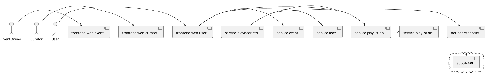

# Architecture Principles
1. Cloud Native - ready to scale to handle hundreds of music events with thousands of users each happening in parallel around the world.
1. Style: Micro Services Architecure 
1. Async, Loose coupled, event driven. No polling at all
1. Design should strive for robust and fast implementation (see NFRs)
1. Resilient - Every component should be deployed/scaled to at least 2 instances 
1. no single point of failure
1. Use Red Hat Enterprise Products as much as possible - avoid community upstream projects.

# Architecture Overview

