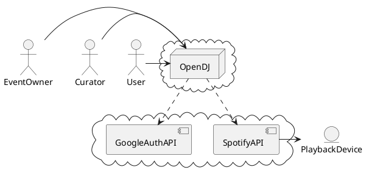

# System Context

This shows the overall context the solution is ru

## Actors

* User - a person contributing to the playlist by adding tracks to the end. There is a easy to use web frontend users can use to join an event.
* Curator - a person choosing the final track selection based on user input. There may be multiple dancers. The maintainers connect to OpenDJ via internet.
* EventOwner - The person responsible for an event where music is being played. 

## Components
* **OpenDJ:**  
The application developed by this project, running somewhere in the cloud. Could also be considered a Software as a Service offering. OpenDJ can host multiple events with hundreds or thousands of users concurrently.

* **SpotifyAPI:** 
Spotify provides a very detailed and powerfull API to search for tracks.
OpenDJ uses the Account/Credentials of the EventOwner.  
The **PlaybackDevice** belongs to the EventOwner and is visible in the Spotify App of the EventOwner. The EventOwner can select in the system on which device the tracks are being played.

* **GoogleAuth:** 
User can optionally login with OpenID connect providers like google, facebook, twitter.

