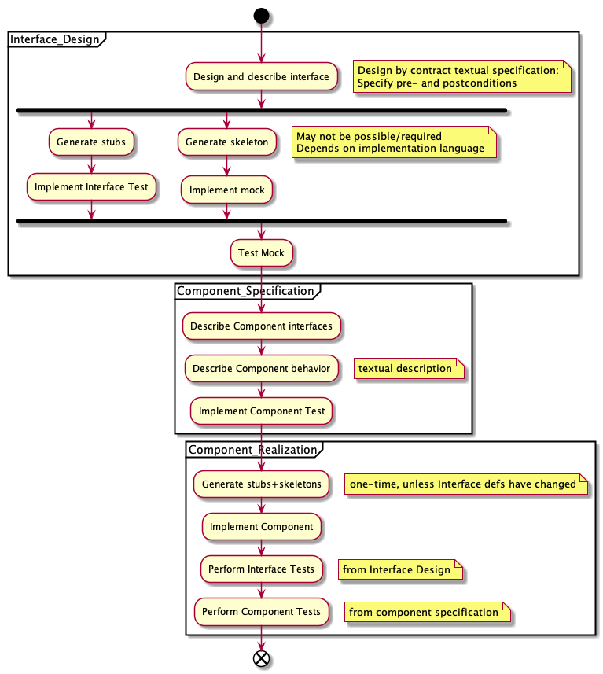

# Development Approach

OpenDJ can be a test-bed for:
* API-first Development
* Test Driven Development (TDD)
* Design by contract
* Continuous Integration
* Microservices
* Event-driven Architecture
* ...

The suggested development process is probably overkill for a project of this size, but is intended to gather experience regarding the concepts mentioned above.

## Assumptions
We can think of microservices as components in [Component-based Software Engineering](https://en.wikipedia.org/wiki/Component-based_software_engineering), with each component being deployed into its own execution environment. The component's behavior is described through its interfaces/APIs, as well as relationships between interfaces ("once function X on interface A has completed successfully, an event Y on interface B is emitted). The former can be codified through an API specification such as [OpenAPI](https://swagger.io/docs/specification/about/) for HTTP/RPC interfaces or [AsyncAPI](https://www.asyncapi.com) for event/message interfaces, the latter through a test which checks the component's behavior in a test harness. These test harnesses can be used fully automated in Continuous Integration. 

The API definition is independent of and therefore not part of the compomnent implementation. Each API should have a mock implementation as well as a separate test UI to allow any API implementation to be tested interactively. Ideally, these test UIs allow HTTP/RPC interactions or reading/writing event/messages from a message broker where required. Using a generic testing tool is fine for this purpose; these test UIs don't need to be custom code.

A certain amount of  behavior can actually be described and tested at the API level (as opposed to the component level). E.g. after creation of an object, that object should be retrievable, after update of an object, the representation returned should contain the update, etc. These behaviors could also be tested in an automated test harness.

## Suggested Approach

### Interface Design
The process starts with the interface design (API first) which includes test development. Outcome of this process is 
* the interface definition, including design by contract aspects such as pre- and postconditions
* a mock implementation of the interface as well as 
* a test UI for the interface and 
* an automated test harness for any API-level behavior tests

### Component Specification
In this step, the component's interfaces (from the previous step) are named togehter with the role in which the component uses the interface (e.g. "client" or "server" or "producer" or "consumer"), and the behavior of the component is described. Outcome of this process is

### Component Realization